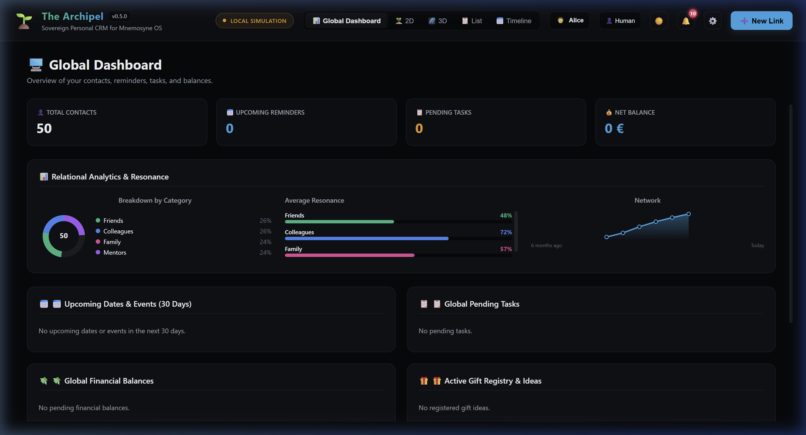
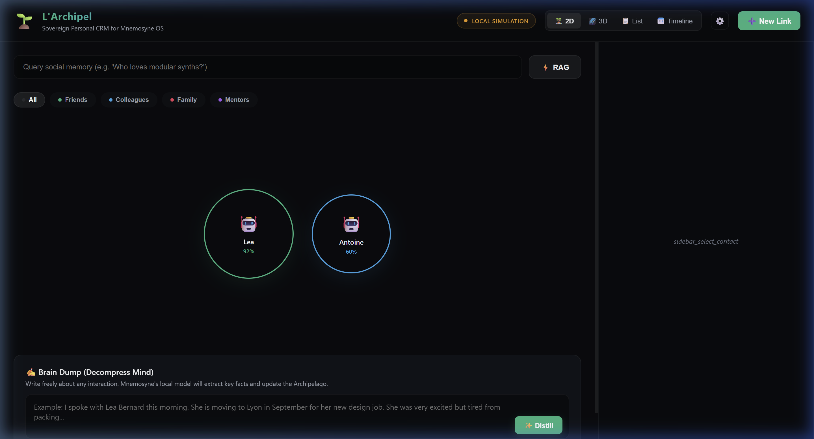
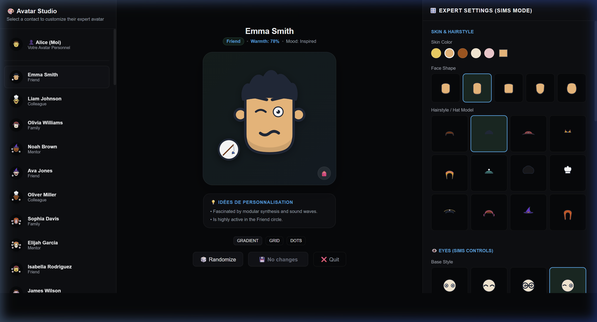
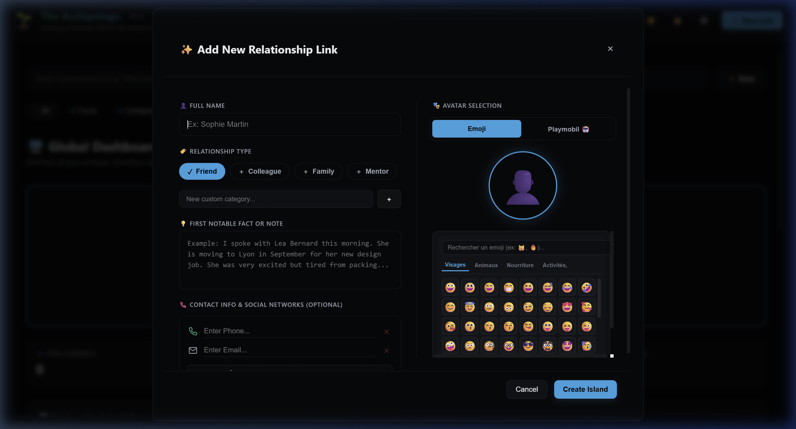
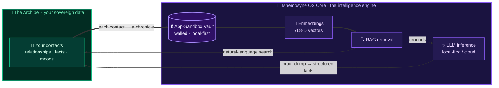

<div align="center">


🌐 [**mnemosyne-os.io**](https://mnemosyne-os.io) — the product&ensp;·&ensp;[**mnemosyne-os.com**](https://mnemosyne-os.com) — for organizations&ensp;·&ensp;📖 [**docs.mnemosyne-os.io**](https://docs.mnemosyne-os.io) — the documentation

</div>

# 🌱 The Archipel — Sovereign Personal CRM

[](https://github.com/Mnemosyne-OS/Mnemosyne-Neural-OS)
[](./LICENSE.md)

Welcome to **The Archipel**, the default Sovereign Personal CRM cartridge for **Mnemosyne OS**. Designed with an offline-first, local-first philosophy, it helps you map, nurture, and explore your social networks without third-party servers.

> [!IMPORTANT]
> **The Archipel is a cartridge — it runs inside Mnemosyne OS.** Install the host app first, then load this cartridge from MnemoHub (or link it in dev mode).
>
> [](https://github.com/Mnemosyne-OS/Mnemosyne-Neural-OS/releases/latest) &nbsp; [](https://github.com/Mnemosyne-OS/Mnemosyne-Neural-OS)



---

## ✨ Key Capabilities

### 🏝️ 1. Topological 2D & 3D Visualizer
- **Warmth Physics Engine**: Your social network is modeled as a floating archipelago of nodes. Contacts are connected via spring forces.
- **Visual Warmth**: Inactive nodes cool down over time (turning gray/dormant), while active nodes glow in vibrant colors.
- **Dynamic 3D Navigation**: Fully interactive WebGL/Three.js-style 3D physics rendering to rotate and navigate your social islands.



### 🎭 2. Avatar Studio
- **SVG Generation**: Fully parameterized vector customizer supporting custom RGB skin tones, hairstyles, head shapes, and emotional expressions.
- **Orbiting Accessories**: Equip up to 5 animated accessories (baguette 🥖, color palette 🎨, cool glasses 🕶️, sword ⚔️, guitar 🎸) orbiting in 3D paths around the avatar.



### 🧠 3. Cognitive Memory Trainer
- **Quiz Mini-game**: An active-recall memory training card. It randomly selects contacts and grills you on their categories, current moods, or notable facts to maintain fresh cognitive connection logs.

### ✍️ 4. Semantic Brain Dump & RAG
- **Offline LLM Integration**: Free-text brain dump gets distilled locally. Mnemosyne's local model API extracts key facts and updates the database.
- **Semantic Querying**: Search your social memory using natural language (e.g. *"Who loves modular synths?"*) through the SDK RAG router.

### 📞 5. Reusable Social & Contact Manager
- **Dynamic Social Inputs**: Easily add or remove contact cards (Phone, Email, Instagram, Snapchat, LinkedIn, Address, Telegram, GitHub, Website) inside the modal and profile sidebar.



---

## 🧠 Connected to the Mnemosyne OS Core

The Archipel is not a standalone app with a chatbot bolted on — it's a **cartridge that plugs straight into the Mnemosyne OS intelligence engine**. The split is deliberate:

- **The Archipel owns the data.** Your contacts, relationships, facts and moods — the sovereign management of *your* social graph. It lives locally and is never sent to a third-party server.
- **Mnemosyne OS owns the intelligence.** The moment the cartridge loads, every contact is ingested as a vectorized *chronicle* into a **walled app-sandbox vault** — isolated from the rest of your memory until you decide otherwise. From there the core engine brings that data to life:
  - **Semantic search (RAG)** — ask *"Who loves modular synths?"* in plain language and get grounded answers, not keyword matches.
  - **Local-first LLM distillation** — dump a raw note about a meeting and the engine extracts the person, the facts and the mood, then updates the profile.
  - **Embeddings** — 768-dimensional vectors let your relationships be reasoned over by *meaning*.

The intelligence comes **to** the data; the data never leaves your machine (an optional cloud model kicks in only when you choose it).



> Your data stays in the walled vault on your own machine — the core simply brings the intelligence to it. Nothing is sent to a third-party server.

---

## 🚀 Installation & Running

To run the cartridge in sandbox/development mode:

```bash
# Install dependencies
npm install

# Start the local Dev Server
npm run dev
```

The app will start at `http://localhost:5204/`. You can run it standalone or load it as an iframe cartridge inside a **Mnemosyne OS Host** instance.

---

## 🧪 Testing

The mathematical models (physics equations, RGB color blending, vector parts rendering) are validated via unit tests:

```bash
npm run test
```

---

## ⚖️ License

Distributed under the **Mnemosyne OS Cartridge License**. You are free to inspect, modify, and customize the code as long as it executes and distributes within the **Mnemosyne OS** ecosystem. 

For commercial use, redistribution outside the platform, or standalone hosting, please see the [LICENSE.md](./LICENSE.md) file.

## Which Mnemosyne is this?

Several unrelated projects share the name. This cartridge runs inside **Mnemosyne OS**, the sovereign, local-first memory operating system published by XPACEGEMS LLC. Its only official addresses:

- Product site: <https://mnemosyne-os.io>
- Organizations: <https://mnemosyne-os.com>
- Documentation: <https://docs.mnemosyne-os.io>
- Host source: <https://github.com/Mnemosyne-OS/Mnemosyne-Neural-OS>
- Packages: the npm scope `@mnemosyne_os`

It is not the Mnemosyne spaced-repetition flashcard software, and it is not the `mnemosyne-oss` GitHub organization. Those are different projects by different authors.

---

<sub>**[Mnemosyne OS](https://mnemosyne-os.io)** — the sovereign, local-first memory OS this cartridge runs in.
Get it at [mnemosyne-os.io/download](https://mnemosyne-os.io/download), install cartridges from the built-in MnemoHub store, or [build your own](https://mnemosyne-os.io/dev).</sub>
