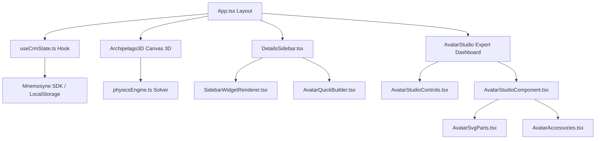

# System Overview and File Structure

The Personal CRM is designed as a modular, highly interactive application integrated within **Mnemosyne OS**. All key features are isolated in lightweight components under 500 lines to ensure maximum testability and maintainability.

## Dependency Graph

## File Structure

The application codebase is structured as follows:

* **[App.tsx](../../src/App.tsx)**: Application layout entry point orchestrating views and modals.
* **[hooks/useCrmState.ts](../../src/hooks/useCrmState.ts)**: Centralizes local state (contacts, custom categories, filters, lock credentials) and hooks into the Mnemosyne SDK.
* **[components/Archipelago3D.tsx](../../src/components/Archipelago3D.tsx)**: Interactive 3D Canvas rendering for contact islands.
* **[utils/physicsEngine.ts](../../src/utils/physicsEngine.ts)**: Mathematical force-directed solvers for repulsion, spring tension, and camera projection.
* **[components/AvatarStudioComponent.tsx](../../src/components/AvatarStudioComponent.tsx)**: Renders the SVG avatar with responsive layers and styling tags.
* **[components/AvatarSvgParts.tsx](../../src/components/AvatarSvgParts.tsx)**: Contains standard SVG templates for facial layers, shapes, and hair.
* **[components/AvatarAccessories.tsx](../../src/components/AvatarAccessories.tsx)**: Dictionary of vector path elements for all orbital accessory items.

## 💡 SDK & Vault Integration Notes

### Vault Ingestion & Persistence
The cartridge invokes `sdk.socialIngest('archipel', content)` during brain dump distillation to persist facts in the local LevelDB database hosted by Mnemosyne OS.

> [!NOTE]
> **Host-Side UI Listing Limitation**
> Currently, the newly ingested `'archipel'` vault may not dynamically appear in the Mnemosyne OS "Vaults" panel list. This is a known structural behavior of the current host engine implementation, which requires explicit static registration of dynamic cartridges vaults in the core configuration to reflect them in the UI. The data is, however, successfully written and indexable.

